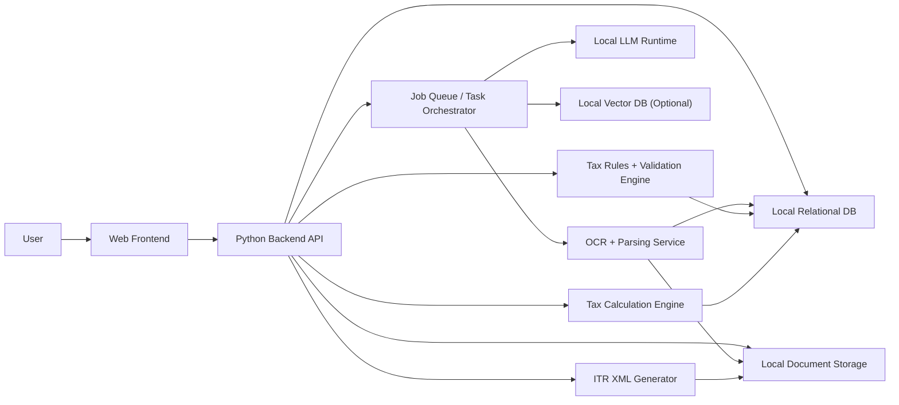
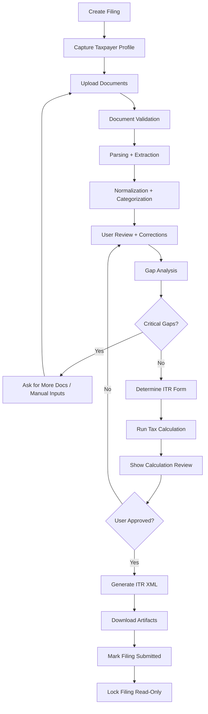

# Detailed Design Document: AI Assistant for Indian Personal Income Tax Filing

## 1. Purpose

This document describes the detailed technical design for a local-first, web-based AI assistant that helps an individual prepare Indian personal income tax returns. It is derived from the approved requirements and is intended to guide implementation decisions, module boundaries, deployment, and future extensibility.

The design assumes:

- Single-user local deployment in V1.
- Support for ITR-1 and ITR-2 in V1.
- Python backend.
- Containerized services.
- No user tax data leaves the local system.
- Local LLM usage for reasoning and assistance.
- Local OCR and parsing.
- Support for foreign income and foreign asset related inputs relevant to personal filing, including RSUs, ESOPs, and foreign dividends.

## 2. Design Goals

The system design should optimize for:

- Privacy: all sensitive processing remains local.
- Determinism: tax logic must be rule-driven, not LLM-driven.
- Explainability: every important value should be traceable to source data and transformation steps.
- Robustness: document parsing failures should degrade gracefully.
- Modularity: parsers, tax rules, OCR, LLM, and storage should be replaceable.
- Extensibility: future support for more ITR forms, revised returns, and additional document types should be straightforward.

## 3. High-Level Architecture

## 3.1 Architecture Overview

The system is a local multi-service application composed of:

1. Web Frontend
2. Python Backend API
3. Background Worker
4. Document Processing Layer
5. Tax Rules and Calculation Engine
6. Local Relational Database
7. Local File/Object Storage
8. Optional Local Vector Database
9. Local LLM Runtime

The frontend communicates only with the backend API. All business logic, document handling, AI orchestration, OCR, tax computation, and XML generation happen behind the backend boundary.

## 3.2 Logical Architecture

## 3.3 Deployment Architecture

V1 should use local containers orchestrated through `docker compose`.

Suggested runtime services:

- `frontend`: SPA or SSR web application
- `backend`: Python API server
- `worker`: Python async background job worker
- `db`: local relational database
- `llm`: local inference server
- `ocr`: OCR/document extraction service if separated
- `vectordb`: optional local vector database

Persistent volumes:

- `documents_volume`: uploaded PDFs and generated artifacts
- `db_volume`: relational database files
- `models_volume`: OCR/LLM model files
- `cache_volume`: temporary processing outputs

## 4. Detailed System Architecture

## 4.1 Frontend

The frontend is responsible for:

- Filing dashboard
- Filing creation and selection
- Taxpayer profile forms
- Document upload and preview
- Validation status display
- Extraction and categorization review
- Gap resolution flows
- Calculation review
- XML download and submission lock
- Historical filing access
- Conversational assistant UI

The frontend should not:

- Parse tax documents
- Run tax calculations
- Make direct calls to OCR/LLM services
- Store authoritative business state outside backend-backed persistence

Recommended frontend design:

- Single-page application with route-based workflow
- State management for UI only
- Backend as source of truth
- Polling or server-pushed updates for long-running jobs

## 4.2 Backend API

The backend is the orchestration core of the system.

Responsibilities:

- Authentication/session management for local single-user access
- Filing CRUD
- Document upload handling
- Validation trigger and status management
- Background job scheduling
- Parsed data normalization
- Categorization review state management
- Gap analysis orchestration
- Tax rule execution
- Calculation snapshot generation
- XML generation
- Audit/history event recording
- LLM prompt orchestration and safety boundaries

The backend should expose modules such as:

- `filings`
- `profiles`
- `documents`
- `processing`
- `classification`
- `gaps`
- `tax_rules`
- `calculations`
- `xml_export`
- `assistant`
- `artifacts`

## 4.3 Background Worker

Long-running operations should be handled asynchronously:

- PDF parsing
- OCR
- Statement extraction
- LLM-assisted interpretation
- Reconciliation
- Gap analysis refresh
- Tax recalculation after major edits
- XML generation

The worker should:

- Consume jobs from a queue or DB-backed task table
- Update job status
- Persist partial results safely
- Retry transient failures
- Mark deterministic failures clearly

## 4.4 Document Processing Layer

This layer transforms uploaded documents into normalized tax-relevant structured data.

Subcomponents:

- File validator
- PDF parser
- OCR adapter for scanned PDFs
- Structured file parser for CSV/XLSX/XML/JSON
- Document classifier
- Field extractor
- Template matcher
- Normalizer
- Reconciliation helper

Design principle:

- Use deterministic parsers first.
- Use OCR only when native extraction is insufficient.
- Use LLM only for interpretation, fallback extraction support, or ambiguity resolution.

## 4.5 Tax Rules and Validation Engine

This is a deterministic module and should be independent of the LLM.

Responsibilities:

- Assessment year and financial year validation
- Filing scenario validation against ITR-1/ITR-2 support
- Document completeness rules
- PAN/date/format validations
- Category plausibility rules
- Foreign income conversion rule enforcement
- Critical gap detection
- Readiness checks before calculation and XML generation

Rules should be versioned by:

- Assessment year
- ITR form family
- Tax rule package version

## 4.6 Tax Calculation Engine

This engine produces the authoritative tax computation output.

Responsibilities:

- Aggregate all validated income items by head
- Apply deductions
- Apply regime logic
- Compute TDS/advance tax/set-off values
- Handle foreign income conversion inputs already normalized into INR
- Produce payable/refund result
- Produce detailed line-by-line explanation objects

The engine should produce immutable calculation snapshots so the UI can show historical recalculation results.

## 4.7 ITR Form Decision Module

This module decides whether the filing is compatible with `ITR-1` or `ITR-2`.

Inputs:

- Taxpayer profile
- Income heads present
- House property count
- Capital gains presence
- Foreign assets/income indicators
- Special disclosures

Outputs:

- Recommended form
- Compatibility status
- Explanation list
- Unsupported-scenario flags if outside V1 scope

## 4.8 ITR XML Generator

This module converts approved filing data into the official schema structure for the selected assessment year and ITR type.

Responsibilities:

- Build XML object graph
- Apply schema-specific field mappings
- Validate mandatory fields
- Validate structure against local schema rules
- Save generated XML artifact

Design constraints:

- XML generation should only use calculation-approved, user-reviewed data
- XML templates and field mappings should be versioned by assessment year and ITR form

## 4.9 Assistant Orchestration Layer

This layer manages all conversational and reasoning use of the local LLM.

Responsibilities:

- Ask for missing information
- Explain document relevance decisions
- Explain categorization suggestions
- Summarize gaps
- Explain tax calculations in plain language
- Support document template retrieval if vector search is used

Guardrails:

- The assistant must not directly decide final tax values
- The assistant must not mutate authoritative financial data without explicit user confirmation
- All AI suggestions should be represented as proposals until approved or accepted by deterministic logic

## 5. Data Flow Through the System

## 5.1 End-to-End Filing Flow

## 5.2 Detailed Data Movement

### Step 1: Filing Creation

- User creates a filing and selects assessment year.
- Frontend sends `CreateFiling` request to backend.
- Backend creates filing record and returns filing ID.

Data created:

- Filing record
- Status = `Draft`
- Tax rule version binding

### Step 2: Taxpayer Profile Capture

- User fills personal details and filing context.
- Frontend submits structured form data.
- Backend validates formats and stores a filing-scoped taxpayer profile snapshot.

Data created/updated:

- Taxpayer profile
- Filing configuration
- Initial eligibility hints

### Step 3: Document Upload

- User uploads PDF or structured files.
- Frontend streams file to backend.
- Backend validates file type and stores original file in local storage.
- Metadata is stored in DB.
- Backend creates processing job.

Data created:

- Document record
- Document version record
- Storage path
- Checksum
- Processing job

### Step 4: Document Validation

- Worker reads document metadata and file.
- File validator verifies supported type and basic integrity.
- Document classifier estimates document class.
- Year validator checks whether date range aligns to filing.

Data created:

- Validation result
- Document state
- Relevance explanation
- Year-fit status

### Step 5: Parsing and Extraction

- For text PDFs: native extractor runs first.
- For scanned PDFs: OCR pipeline runs.
- For structured files: parser adapter runs.
- Extracted fields are normalized into canonical domain objects.
- Low-confidence items are marked.

Data created:

- Raw extraction output
- Parsed field records
- Confidence values
- Source provenance references
- Normalized candidate tax items

### Step 6: Categorization

- Rule-based classifier assigns initial categories.
- LLM may assist with ambiguous descriptions.
- System generates category proposals for review.

Data created:

- Candidate category assignments
- Confidence and rationale
- Conflict flags

### Step 7: User Review and Correction

- Frontend loads extracted items grouped by source and category.
- User edits values, accepts suggestions, changes categories, or marks not applicable.
- Backend persists overrides without deleting original extracted values.

Data updated:

- Validated tax items
- Manual override records
- User confirmation flags

### Step 8: Gap Analysis

- Backend combines taxpayer profile, document inventory, and validated tax items.
- Rule engine evaluates missing mandatory data/documents.
- Assistant converts technical gaps into user-friendly prompts.

Data created:

- Gap items
- Severity
- Required action
- Resolution status

### Step 9: ITR Form Determination

- Backend passes resolved structured filing data to the ITR decision module.
- Module evaluates compatibility with ITR-1 and ITR-2.
- Unsupported scenarios are blocked with explanation.

Data created:

- Recommended ITR form
- Decision rationale
- Supportability flags

### Step 10: Tax Calculation

- Backend builds a calculation input snapshot from user-validated data.
- Tax engine computes totals, deductions, credits, tax liability, and refund/payable status.
- For foreign amounts, engine uses normalized INR values and stores conversion references.

Data created:

- Calculation snapshot
- Calculation lines
- Rule application explanations
- Regime comparison if applicable

### Step 11: XML Generation

- After user approval, backend maps calculation and filing data into schema structures.
- Generator validates mandatory completeness and produces XML.
- XML file is stored locally and exposed for download.

Data created:

- XML artifact
- XML generation record
- Version metadata

### Step 12: Submission Lock

- User marks filing as submitted/done.
- Backend records submission timestamp and locks the filing.
- UI switches to read-only behavior.

Data updated:

- Filing status = `Submitted / Done`
- Read-only lock flag
- Submission metadata

## 5.3 Foreign Income and Foreign Asset Data Flow

This flow is especially important because V1 supports foreign income/asset related personal filing inputs within supported ITR forms.

### Supported V1 foreign scenarios

- Foreign dividends
- RSU / ESOP related documents and taxable events within ITR-2 compatible scenarios
- Foreign broker statements relevant to personal holdings and sales

### Data handling flow

1. User uploads foreign broker, equity compensation, or foreign dividend documents.
2. Parser extracts source-country, currency, event date, security/asset descriptor, and amount.
3. Normalizer converts extracted events into canonical records such as:
   - foreign_dividend
   - rsu_vesting_event
   - esop_sale_event
   - foreign_tax_withheld
4. Conversion module derives INR values using configured exchange-rate logic.
5. Both original currency and INR values are stored.
6. Gap engine checks whether supporting event details or withholding details are missing.
7. Tax engine consumes only normalized, user-reviewed values.

### Currency conversion design

The conversion submodule should store:

- Source currency
- Source amount
- Conversion date
- Exchange-rate value
- Exchange-rate source identifier
- INR result
- Conversion-rule version

The design should keep the rate source pluggable because exact tax treatment or operational preference may vary by implementation.

## 6. Internal Modules and Responsibilities

## 6.1 Filing Module

Tables/entities:

- `filings`
- `filing_status_history`
- `filing_versions`

Responsibilities:

- Create/update filing metadata
- Manage workflow state transitions
- Enforce read-only lock

## 6.2 Profile Module

Tables/entities:

- `taxpayer_profiles`
- `bank_accounts`
- `residency_details`

Responsibilities:

- Store filing-specific taxpayer data
- Validate core identity and banking fields

## 6.3 Document Module

Tables/entities:

- `documents`
- `document_versions`
- `document_storage_refs`
- `document_validation_results`

Responsibilities:

- Upload lifecycle
- Checksum-based duplicate detection
- File type enforcement
- Local storage path tracking

## 6.4 Extraction Module

Tables/entities:

- `processing_jobs`
- `raw_extractions`
- `parsed_fields`
- `field_provenance`

Responsibilities:

- Run parser adapters
- Store raw and normalized extraction outputs
- Track confidence

## 6.5 Classification Module

Tables/entities:

- `tax_items`
- `category_assignments`
- `manual_overrides`

Responsibilities:

- Propose categories
- Store accepted categories
- Preserve source and override lineage

## 6.6 Gap Analysis Module

Tables/entities:

- `gap_items`
- `gap_resolutions`

Responsibilities:

- Detect missing information
- Track gap lifecycle
- Support re-evaluation after new inputs

## 6.7 Tax Engine Module

Tables/entities:

- `calculation_snapshots`
- `calculation_lines`
- `regime_comparisons`

Responsibilities:

- Deterministic tax computation
- Explanation generation
- Immutable snapshot persistence

## 6.8 XML Module

Tables/entities:

- `generated_artifacts`
- `xml_generation_runs`

Responsibilities:

- Versioned XML generation
- Validation of export readiness

## 6.9 Assistant Module

Tables/entities:

- `assistant_messages`
- `assistant_suggestions`

Responsibilities:

- Manage natural language interactions
- Persist suggestion metadata if needed for UX continuity

## 7. Data Model Design

## 7.1 Core Entities

Suggested primary entities:

- `filings`
- `taxpayer_profiles`
- `documents`
- `document_versions`
- `processing_jobs`
- `parsed_fields`
- `tax_items`
- `category_assignments`
- `manual_overrides`
- `gap_items`
- `itr_decisions`
- `calculation_snapshots`
- `generated_artifacts`

## 7.2 Canonical Tax Item Model

Every normalized tax item should carry:

- `filing_id`
- `source_document_id`
- `source_field_ref`
- `item_type`
- `income_head`
- `category_code`
- `amount_original`
- `currency_code`
- `amount_in_inr`
- `event_date`
- `assessment_year`
- `confidence_score`
- `review_status`
- `user_confirmed`

Examples of `item_type`:

- `salary_component`
- `tds_credit`
- `bank_interest`
- `dividend_domestic`
- `dividend_foreign`
- `capital_gain`
- `rsu_vesting`
- `esop_sale`
- `deduction_80c`
- `home_loan_interest`

## 7.3 Provenance Model

Every derived value should be traceable through:

- file reference
- page number or row reference
- extraction run ID
- parser type
- rule version
- override marker

This allows the UI to explain where a number came from and what changed after review.

## 8. API Design Overview

Representative API groups:

- `POST /filings`
- `GET /filings`
- `GET /filings/{id}`
- `PATCH /filings/{id}`
- `POST /filings/{id}/documents`
- `GET /filings/{id}/documents`
- `POST /documents/{id}/process`
- `GET /documents/{id}/status`
- `GET /filings/{id}/review-items`
- `POST /filings/{id}/review-items/{itemId}/confirm`
- `POST /filings/{id}/review-items/{itemId}/override`
- `GET /filings/{id}/gaps`
- `POST /filings/{id}/gaps/{gapId}/resolve`
- `POST /filings/{id}/itr-decision`
- `POST /filings/{id}/calculate`
- `GET /filings/{id}/calculation`
- `POST /filings/{id}/generate-xml`
- `GET /filings/{id}/artifacts`
- `POST /filings/{id}/mark-submitted`
- `POST /assistant/messages`

## 9. Technical Stack and Where It Is Used

## 9.1 Recommended Baseline Stack

### Frontend

- `React` with `TypeScript`
- Used for the web UI, workflow screens, review interfaces, and assistant chat

### Backend API

- `Python`
- Recommended framework: `FastAPI`
- Used for API endpoints, orchestration, validation services, and export logic

### Worker

- `Python`
- Recommended queue pattern: async worker process using task queue or DB-backed jobs
- Used for document processing and long-running computation

### Database

- Local relational DB
- Used for filings, structured extracted data, review state, and historical records

### File Storage

- Local filesystem mounted in containers
- Used for PDFs, structured uploads, generated XML, and parsing artifacts

### OCR

- Local OCR engine or OCR service
- Used only when scanned PDFs cannot be parsed natively

### LLM Runtime

- Local inference server
- Used for reasoning assistance, not deterministic tax logic

### Optional Vector DB

- Local vector store
- Used for template retrieval, help snippets, and document-layout support if needed

## 9.2 Recommended Implementation Mapping

| Layer | Recommended Choice | Why |
|---|---|---|
| Frontend | React + TypeScript | Strong UI ecosystem and maintainable form-heavy workflows |
| Backend API | FastAPI | Python-native, strong typing support, easy async APIs |
| Worker | Python worker process | Same language as backend and tax engine |
| Document Storage | Local filesystem | Simple, private, efficient for local deployment |
| DB | PostgreSQL or SQLite | Reliable relational persistence depending deployment complexity |
| OCR | OCRmyPDF/Tesseract or PaddleOCR | Local PDF-oriented OCR options |
| LLM Serving | Ollama or vLLM-based local serving | Good local runtime ergonomics |
| Vector DB | Chroma / Qdrant / SQLite-based vector extension | Local-first retrieval options |
| Containers | Docker Compose | Best fit for local single-user service orchestration |

## 10. Decision Options

This section provides 3-4 options for each key technical decision, with reasons and tradeoffs.

## 10.1 Local LLM Options

The LLM is used for:

- Natural language guidance
- Ambiguous document interpretation
- Categorization assistance
- Gap explanation
- Calculation explanation

The LLM should not be used as the final authority for tax computations.

### Option 1: `Llama 3.1/3.2 Instruct` via Ollama

Why choose it:

- Mature local ecosystem
- Good general reasoning quality for assistant-style interaction
- Easy local setup with Ollama
- Large community support and examples

Strengths:

- Fast to adopt
- Good balance of capability and usability
- Works well for classification/explanation tasks

Tradeoffs:

- May require larger hardware for stronger variants
- Not specialized for financial document reasoning

Best fit:

- Strong default option for a local-first V1

### Option 2: `Qwen 2.5 Instruct`

Why choose it:

- Strong multilingual and structured reasoning performance
- Often performs well on extraction-style interpretation
- Good compact model options for constrained hardware

Strengths:

- Good instruction following
- Useful for structured summarization and document interpretation
- Strong performance-per-parameter

Tradeoffs:

- Operational familiarity may be lower for some teams than Llama-based setups
- Quality depends on chosen size and quantization

Best fit:

- Strong option if hardware is moderate and document interpretation quality is prioritized

### Option 3: `Mistral / Mixtral Instruct`

Why choose it:

- Good reasoning quality
- Often efficient for local inference relative to capability
- Useful for explanation and classification tasks

Strengths:

- Strong general-purpose assistant behavior
- Often good latency on suitable hardware

Tradeoffs:

- Some variants may still be heavy for personal local machines
- Structured extraction quality may vary by prompt design

Best fit:

- Good option when balanced reasoning and local serving flexibility matter

### Option 4: `Phi-3 / Phi-4 Mini` class models

Why choose it:

- Smaller footprint
- Better fit for CPU-only or lower-resource hardware
- Good for lightweight prompting tasks

Strengths:

- Faster local inference
- Lower hardware requirements

Tradeoffs:

- More limited reasoning depth
- More likely to need deterministic guardrails and fallback logic

Best fit:

- Good fallback for low-resource environments, not ideal as the primary model for complex cases

### LLM Recommendation

Recommended shortlist:

1. `Qwen 2.5 Instruct`
2. `Llama 3.1/3.2 Instruct`
3. `Phi` class model for low-resource fallback

Reason:

- `Qwen 2.5` is a strong candidate if extraction interpretation and structured assistance are important.
- `Llama 3.x` is a safer ecosystem choice for broad support and easier team adoption.
- A smaller fallback model is useful for machines without GPU support.

## 10.2 OCR Stack Options

OCR is needed for scanned PDFs only, because V1 does not support standalone image uploads.

### Option 1: `OCRmyPDF + Tesseract`

Why choose it:

- Excellent PDF-centric workflow
- Adds searchable text layers to scanned PDFs
- Mature, open source, easy local packaging

Strengths:

- Works naturally with PDF-first document intake
- Good base pipeline for scanned tax documents
- Strong operational simplicity

Tradeoffs:

- Accuracy may be weaker on messy layouts or low-quality scans
- Complex tables may require extra extraction steps

Best fit:

- Strong default V1 OCR stack for PDF-based tax workflows

### Option 2: `PaddleOCR`

Why choose it:

- Often stronger on document layout/text detection tasks
- Better handling of varied layouts and multilingual text
- Useful when documents contain complex tabular structures

Strengths:

- Better extraction flexibility
- Good for harder layouts and lower-quality scans

Tradeoffs:

- More moving parts than a simple OCRmyPDF pipeline
- Integration effort is somewhat higher

Best fit:

- Good option when statement/table extraction quality is more important than implementation simplicity

### Option 3: `EasyOCR`

Why choose it:

- Easy to start with
- Works well for many general OCR use cases
- Lightweight developer experience

Strengths:

- Simple setup
- Reasonable baseline for experimentation

Tradeoffs:

- Usually not the strongest option for production-grade PDF-heavy financial workflows
- Layout understanding is limited compared to stronger document OCR stacks

Best fit:

- Prototype or fallback option, not first recommendation for V1 production

### Option 4: `docTR`

Why choose it:

- Designed for OCR and document text extraction tasks
- Can be effective when combined with structured parsing workflows

Strengths:

- Modern OCR/document AI approach
- Good option for future more advanced extraction pipelines

Tradeoffs:

- More implementation effort
- Higher evaluation burden for real-world financial documents

Best fit:

- Good R&D option if the project later needs more sophisticated document understanding

### OCR Recommendation

Recommended shortlist:

1. `OCRmyPDF + Tesseract`
2. `PaddleOCR`
3. `docTR` for future advanced evaluation

Reason:

- `OCRmyPDF + Tesseract` aligns best with PDF-only intake and a local-first V1.
- `PaddleOCR` is the best alternative if extraction quality on complex statements becomes the main issue.

## 10.3 Relational Database Options

The relational database stores all authoritative structured state.

### Option 1: `PostgreSQL`

Why choose it:

- Strong relational integrity
- Excellent JSON support
- Mature tooling and migrations
- Good for future complexity growth

Strengths:

- Best long-term maintainability
- Handles structured + semi-structured data well
- Strong transaction semantics

Tradeoffs:

- Heavier operational footprint than SQLite
- More setup overhead for a purely local single-user app

Best fit:

- Best choice if you want durability and easier future expansion beyond a simple prototype

### Option 2: `SQLite`

Why choose it:

- Extremely simple local deployment
- Single-file storage
- Excellent fit for single-user local-first software

Strengths:

- Lowest operational complexity
- Easy backups at the filesystem level if ever needed operationally
- Good performance for moderate local workloads

Tradeoffs:

- Limited concurrency compared to PostgreSQL
- Less ideal if background jobs and API writes become very busy

Best fit:

- Very strong V1 choice for a single-user local application

### Option 3: `DuckDB`

Why choose it:

- Strong analytical performance
- Useful if many statements or calculation audits become query-heavy

Strengths:

- Great for analysis-heavy workloads
- Efficient local processing

Tradeoffs:

- Not the best primary OLTP database for application state management
- Weaker fit for workflow-driven app persistence

Best fit:

- Secondary analytics engine, not recommended as the main transactional store

### Option 4: `MariaDB/MySQL`

Why choose it:

- Familiar relational platform
- Solid ecosystem

Strengths:

- Reliable and widely known

Tradeoffs:

- Fewer advantages than PostgreSQL for this kind of structured + semi-structured app data
- Less compelling for local single-user deployment

Best fit:

- Acceptable but not preferred

### Relational DB Recommendation

Recommended shortlist:

1. `SQLite` for simplest V1
2. `PostgreSQL` for more scalable and future-friendly V1

Reason:

- `SQLite` matches the approved single-user local-first requirement very well.
- `PostgreSQL` becomes preferable if you expect higher complexity, more background processing, or a cleaner path to future expansion.

## 10.4 Vector Database Options

The vector DB is optional in V1. It is useful only if retrieval-based assistance is needed.

### Option 1: `Chroma`

Why choose it:

- Very easy local setup
- Friendly for embedded/local applications
- Good enough for small retrieval workloads

Strengths:

- Simple developer experience
- Good fit for optional local semantic retrieval

Tradeoffs:

- Less operational depth than heavier systems

Best fit:

- Best default if vector retrieval is small and local

### Option 2: `Qdrant`

Why choose it:

- Strong local/vector search capabilities
- Better operational maturity than minimal embedded options

Strengths:

- Excellent filtering + vector retrieval support
- Good long-term option if retrieval grows in importance

Tradeoffs:

- More operational weight than Chroma

Best fit:

- Best choice if you expect retrieval to grow beyond a small helper feature

### Option 3: `FAISS` with local metadata store

Why choose it:

- High-performance vector similarity library
- Flexible and lightweight if custom retrieval is acceptable

Strengths:

- Fast and efficient
- Good for controlled custom retrieval pipelines

Tradeoffs:

- Not a full database by itself
- Requires separate metadata management

Best fit:

- Good engineering option if you want maximum control

### Option 4: `pgvector` on PostgreSQL

Why choose it:

- Keeps relational and vector data together
- Simplifies deployment if PostgreSQL is already chosen

Strengths:

- Fewer separate services
- Strong convenience and consistency

Tradeoffs:

- Not available if SQLite is chosen as primary DB
- Vector scale/features may be less specialized than Qdrant

Best fit:

- Strong option when PostgreSQL is already the main DB

### Vector DB Recommendation

Recommended shortlist:

1. `No vector DB in earliest V1` if deterministic templates are enough
2. `Chroma` for simple local retrieval
3. `pgvector` if PostgreSQL is selected
4. `Qdrant` if retrieval becomes important

Reason:

- Vector retrieval is optional for the current scope.
- A minimal initial design should avoid introducing a vector service unless it clearly improves parsing/template retrieval or assistant guidance.

## 11. Recommended V1 Stack Combinations

## Option A: Simplest Local-First V1

- Frontend: React + TypeScript
- Backend: FastAPI
- Worker: Python worker with DB-backed jobs
- DB: SQLite
- OCR: OCRmyPDF + Tesseract
- LLM: Qwen 2.5 Instruct via Ollama
- Vector DB: none initially

Why choose it:

- Lowest operational complexity
- Strong alignment to single-user local deployment
- Fastest path to a buildable MVP

## Option B: More Future-Ready V1

- Frontend: React + TypeScript
- Backend: FastAPI
- Worker: Python worker + queue
- DB: PostgreSQL
- OCR: OCRmyPDF + Tesseract with optional PaddleOCR fallback
- LLM: Llama 3.x or Qwen 2.5 via Ollama/vLLM
- Vector DB: pgvector or Qdrant

Why choose it:

- Cleaner path to scale feature complexity
- Better foundation if document diversity and retrieval needs grow quickly

## Option C: Extraction-Quality Prioritized V1

- Frontend: React + TypeScript
- Backend: FastAPI
- Worker: Python worker
- DB: PostgreSQL
- OCR: PaddleOCR
- LLM: Qwen 2.5 Instruct
- Vector DB: Chroma or Qdrant

Why choose it:

- Better suited if document extraction quality is expected to be the toughest problem
- Higher implementation complexity but stronger parsing flexibility

## 12. Design Risks and Mitigations

## Risk 1: Extraction quality is inconsistent across real-world documents

Mitigations:

- Prefer parser adapters per document type
- Use PDF-native extraction first
- Keep OCR modular
- Require user review for low-confidence items

## Risk 2: Tax rules become mixed with LLM behavior

Mitigations:

- Keep deterministic tax rules in a separate engine
- Treat LLM outputs as suggestions only
- Store normalized reviewed items before tax calculation

## Risk 3: Foreign income handling becomes ambiguous

Mitigations:

- Normalize every foreign event with explicit provenance
- Store both source and INR values
- Make exchange-rate logic versioned and configurable
- Force user review on low-confidence foreign events

## Risk 4: Unsupported scenarios are accidentally processed

Mitigations:

- Strong V1 compatibility checks for ITR-1 and ITR-2 only
- Explicit unsupported-scenario blocking
- Clear UX messaging for out-of-scope cases

## 13. Recommended Next Design Decisions

Before implementation, the following choices should be finalized:

1. Choose `SQLite` vs `PostgreSQL`
2. Choose `Qwen 2.5` vs `Llama 3.x` as primary local LLM
3. Choose `OCRmyPDF + Tesseract` vs `PaddleOCR`
4. Decide whether vector retrieval is needed in V1 at all
5. Define the first parser set for V1 document types
6. Define the exchange-rate source and conversion policy for foreign currency normalization

## 14. Implementation Recommendation

The most balanced V1 path is:

- `React + TypeScript` frontend
- `FastAPI` backend
- `SQLite` as initial local DB
- local filesystem for documents/artifacts
- `OCRmyPDF + Tesseract` as primary OCR stack
- `Qwen 2.5 Instruct` or `Llama 3.x Instruct` via Ollama
- no vector DB in the earliest V1 unless document-template retrieval proves necessary

This combination best satisfies the current requirements:

- fully local
- single-user friendly
- Python-centered backend
- low operational complexity
- enough AI support for assistant behavior and document interpretation
- clear separation between deterministic tax logic and AI assistance
