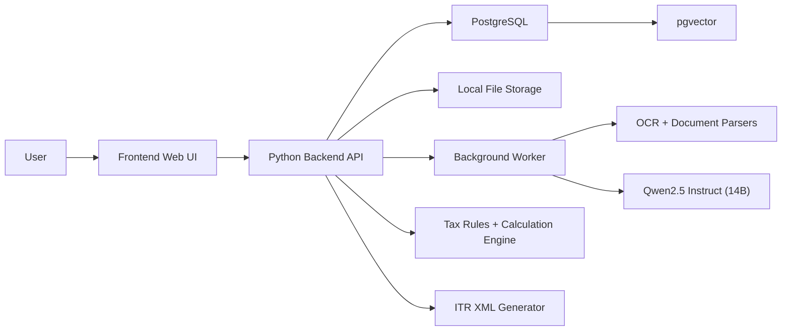

# Phase-Wise Design Document: AI Assistant for Indian Personal Income Tax Filing

## 1. Purpose

This document converts the finalized requirements into a phase-wise technical design plan.

The goal is to define:

- how the system should be designed in implementation order
- what each phase should deliver
- which modules, data structures, and integrations belong to each phase
- what dependencies exist between phases
- when the system becomes usable for increasingly complete tax filing workflows

This design is based on the finalized requirements and current decisions:

- local-first deployment
- web-based frontend
- Python backend
- `Qwen2.5 Instruct (14B)` as the selected local LLM
- `PostgreSQL` as the selected relational database
- `pgvector` as the selected vector database technology
- single-user V1
- support for `ITR-1` and `ITR-2`

## 2. Design Principles

The phase plan follows these design principles:

- Build deterministic core workflow before advanced AI assistance.
- Keep tax calculation and ITR selection rule-based.
- Add AI only where it improves interpretation, explanation, or user guidance.
- Build around audited, reviewable state transitions.
- Keep every phase independently testable and incrementally useful.

## 3. High-Level Delivery Phases

Recommended phase breakdown:

1. Phase 0: Foundation and Infrastructure
2. Phase 1: Filing Workspace and Profile Management
3. Phase 2: Document Intake and Storage
4. Phase 3: Parsing, Extraction, and Normalization
5. Phase 4: Review, Categorization, and Gap Analysis
6. Phase 5: ITR Selection and Tax Calculation
7. Phase 6: XML Generation, Locking, and History
8. Phase 7: Hardening, Evaluation, and Release Readiness

This order is chosen because it mirrors the real tax filing journey:

- create filing
- collect data
- understand documents
- validate data
- compute taxes
- generate output
- preserve history

## 4. Target End-State Architecture

All phases build toward this target architecture:

## 5. Phase 0: Foundation and Infrastructure

## 5.1 Objective

Establish the runtime foundation needed for all later phases.

## 5.2 Scope

- containerized local deployment skeleton
- PostgreSQL setup
- `pgvector` enablement
- local LLM container integration
- backend service skeleton
- worker service skeleton
- frontend service skeleton
- environment configuration and health checks

## 5.3 Technical Design

### Infrastructure

- `docker-compose` based local stack
- persistent volumes for:
  - PostgreSQL
  - uploaded documents
  - generated artifacts
  - LLM model storage
  - temp processing files

### Core services

- `frontend`
- `backend`
- `worker`
- `postgres`
- `llm`

### Database

At this phase:

- enable `pgvector`
- establish migration framework
- create schema namespaces if needed
- define connection settings

### Backend

Provide:

- app startup
- `/health` endpoint
- environment loading
- DB connection layer
- migration runner hook

### Worker

Provide:

- background process skeleton
- job polling or async task mechanism placeholder

## 5.4 Deliverables

- deployment scaffold
- DB bootstrap
- service health checks
- configuration model

## 5.5 Exit Criteria

- all containers can be built
- backend connects to PostgreSQL
- `pgvector` is enabled
- backend can reach LLM service
- volumes are mounted correctly

## 6. Phase 1: Filing Workspace and Profile Management

## 6.1 Objective

Build the minimum usable filing workspace and taxpayer profile flow.

## 6.2 Scope

- create filing
- select assessment year
- manage filing status
- capture taxpayer profile
- save drafts
- resume filings
- open submitted filings read-only
- duplicate historical filings

## 6.3 Modules

- Filing Management Module
- Taxpayer Profile Module
- Status Transition Module

## 6.4 Data Model

Create primary tables such as:

- `filings`
- `filing_status_history`
- `taxpayer_profiles`
- `bank_accounts`
- `residency_details`

Key fields:

- filing ID
- assessment year
- financial year mapping
- filing status
- created/updated timestamps
- read-only lock flag

## 6.5 Backend Design

Core APIs:

- `POST /filings`
- `GET /filings`
- `GET /filings/{id}`
- `PATCH /filings/{id}`
- `POST /filings/{id}/duplicate`
- `POST /filings/{id}/mark-submitted`

Validation responsibilities:

- PAN format
- date format
- mandatory profile fields
- status transition correctness

## 6.6 Frontend Design

Screens:

- filing dashboard
- new filing flow
- filing details page
- taxpayer profile form
- historical filing list

## 6.7 Exit Criteria

- user can create and save a filing
- user can edit taxpayer profile
- user can reopen draft filings
- submitted filings are read-only

## 7. Phase 2: Document Intake and Storage

## 7.1 Objective

Allow users to upload and manage tax documents safely and locally.

## 7.2 Scope

- upload supported documents
- reject unsupported formats
- store files locally
- create document metadata records
- support preview and replacement
- version document records

## 7.3 Modules

- Document Intake Module
- File Validation Module
- Document Storage Module

## 7.4 Data Model

Create tables such as:

- `documents`
- `document_versions`
- `document_storage_refs`
- `document_upload_events`

Important metadata:

- original filename
- checksum
- MIME type
- file type
- source
- upload timestamp
- processing status

## 7.5 Backend Design

Core APIs:

- `POST /filings/{id}/documents`
- `GET /filings/{id}/documents`
- `GET /documents/{id}`
- `POST /documents/{id}/replace`

Validation rules:

- accept `PDF`, `CSV`, `XLSX`, `JSON`, `XML`
- reject `JPG`, `JPEG`, `PNG`
- detect duplicates by checksum and metadata

## 7.6 Frontend Design

Screens/components:

- document upload panel
- document list
- document status badges
- duplicate/relevance warning display

## 7.7 Exit Criteria

- user can upload documents for a filing
- unsupported image uploads are blocked
- uploaded documents are stored locally and versioned
- document metadata is persisted

## 8. Phase 3: Parsing, Extraction, and Normalization

## 8.1 Objective

Convert uploaded documents into normalized structured tax data.

## 8.2 Scope

- document relevance validation
- year validation
- parseability detection
- OCR for scanned PDFs
- native PDF extraction
- structured file parsing
- extraction of relevant fields
- normalized tax item generation

## 8.3 Modules

- OCR and Parsing Module
- Extraction Module
- Normalization Module
- Document Classification Module

## 8.4 Processing Design

### Parsing order

1. file integrity check
2. document type classification
3. native text extraction when possible
4. OCR fallback for scanned PDFs
5. structured parser for structured files
6. LLM-assisted interpretation for ambiguous fields
7. normalization into canonical records

### Canonical normalized entities

- parsed document
- parsed field
- provenance record
- tax item candidate
- foreign event record

## 8.5 Foreign Income Design

At this phase, support parsing of:

- foreign dividend statements
- RSU vesting statements
- ESOP event documents
- broker statements
- foreign withholding references

Store:

- source currency
- source amount
- event date
- broker/platform
- country
- asset/security identifier
- withholding data

## 8.6 Data Model

Create tables such as:

- `processing_jobs`
- `document_validation_results`
- `raw_extractions`
- `parsed_fields`
- `field_provenance`
- `normalized_tax_items`
- `foreign_income_events`

## 8.7 Worker Design

Background jobs:

- validate document
- parse document
- run OCR
- extract fields
- normalize tax items

Status values:

- pending
- processing
- completed
- failed
- needs_review

## 8.8 Exit Criteria

- documents can be validated locally
- supported documents can be parsed locally
- extracted values are stored with provenance
- foreign-income-related records can be normalized

## 9. Phase 4: Review, Categorization, and Gap Analysis

## 9.1 Objective

Turn extracted candidate data into user-reviewed filing data.

## 9.2 Scope

- categorize extracted items
- show confidence levels
- allow user overrides
- allow item splitting and recategorization
- run gap analysis
- ask for missing data/documents

## 9.3 Modules

- Extraction Review Module
- Classification and Reconciliation Module
- Gap Analysis Module
- Assistant Guidance Module

## 9.4 Categorization Design

The system should map candidate items into:

- salary income
- interest income
- domestic dividend income
- foreign dividend income
- capital gains
- house property entries
- deduction entries
- TDS credits
- self-assessment tax
- advance tax
- other sources

The category engine should combine:

- deterministic rules
- document-type-specific heuristics
- LLM assistance for ambiguity explanation only

## 9.5 Review UX Design

The review UI should show:

- document source
- extracted line item
- suggested category
- confidence
- user action options
- source snippet/page reference

User actions:

- accept
- edit
- split
- reject
- mark for later

## 9.6 Gap Analysis Design

Gap analysis should evaluate:

- missing mandatory documents
- inconsistent financial year data
- missing TDS support
- missing deduction proofs
- missing foreign-income event details
- missing conversion-basis details

Each gap should contain:

- gap code
- severity
- user-facing explanation
- suggested action
- resolution status

## 9.7 Data Model

Create tables such as:

- `category_assignments`
- `manual_overrides`
- `review_sessions`
- `gap_items`
- `gap_resolutions`

## 9.8 APIs

- `GET /filings/{id}/review-items`
- `POST /review-items/{id}/accept`
- `POST /review-items/{id}/override`
- `POST /review-items/{id}/split`
- `GET /filings/{id}/gaps`
- `POST /gaps/{id}/resolve`

## 9.9 Exit Criteria

- user can review and override extracted data
- categorized items are stored separately from raw extracted values
- gap analysis identifies missing critical information
- unresolved critical gaps block calculation

## 10. Phase 5: ITR Selection and Tax Calculation

## 10.1 Objective

Turn reviewed data into a deterministic filing computation.

## 10.2 Scope

- choose between `ITR-1` and `ITR-2`
- block unsupported filing scenarios
- calculate taxes
- support regime comparison where applicable
- convert foreign currency values to INR for tax logic

## 10.3 Modules

- ITR Determination Module
- Tax Rules Engine
- Tax Calculation Engine
- Foreign Conversion Module

## 10.4 ITR Determination Design

Decision factors:

- income heads present
- foreign assets/income present
- capital gains presence
- number of house properties
- special disclosures

Output:

- selected ITR form
- explanation
- compatibility flags
- unsupported reason if outside V1

## 10.5 Calculation Design

Calculation inputs should come only from:

- reviewed tax items
- resolved gap set
- filing profile
- rule version for assessment year

The calculation engine must never consume raw unreviewed extraction values as final truth.

### Foreign currency design

For foreign items:

- keep original currency value
- convert into INR
- store conversion date
- store exchange-rate value
- store conversion basis/rule version

### Output structure

- calculation snapshot header
- line-by-line calculation entries
- tax summary
- regime comparison summary
- warnings and assumptions

## 10.6 Data Model

Create tables such as:

- `itr_decisions`
- `calculation_snapshots`
- `calculation_lines`
- `regime_comparisons`
- `currency_conversions`

## 10.7 APIs

- `POST /filings/{id}/itr-decision`
- `POST /filings/{id}/calculate`
- `GET /filings/{id}/calculation`

## 10.8 Frontend Design

Screens:

- ITR recommendation panel
- tax calculation summary
- detailed explanation view
- recalculation trigger after edits

## 10.9 Exit Criteria

- supported filings can be mapped to `ITR-1` or `ITR-2`
- unsupported filings are clearly blocked
- tax calculations are reproducible and reviewable
- foreign-income calculations preserve both source and INR values

## 11. Phase 6: XML Generation, Locking, and History

## 11.1 Objective

Produce final filing artifacts and complete the filing lifecycle.

## 11.2 Scope

- XML generation
- XML validation
- filing summary export
- mark filing as submitted
- read-only locking
- historical browsing and comparison

## 11.3 Modules

- XML Generation Module
- Artifact Management Module
- Submission Lock Module
- Filing History Module

## 11.4 XML Design

The XML generator should:

- map reviewed/calculated data into schema-specific structures
- validate mandatory fields before generation
- generate assessment-year-specific XML
- save XML artifact locally
- version XML outputs

## 11.5 Submission Locking Design

When user marks the filing as submitted:

- filing status changes to `Submitted / Done`
- edit endpoints should reject mutations
- UI should switch to read-only
- original historical record must remain immutable

## 11.6 History Design

The history layer should support:

- list all filings
- filter by status/year
- open prior filings
- duplicate historical filing into new draft

## 11.7 Data Model

Create tables such as:

- `generated_artifacts`
- `xml_generation_runs`
- `submission_records`

## 11.8 APIs

- `POST /filings/{id}/generate-xml`
- `GET /filings/{id}/artifacts`
- `POST /filings/{id}/mark-submitted`
- `GET /filings/history`

## 11.9 Exit Criteria

- user can generate XML for eligible filings
- XML is versioned and stored locally
- submitted filings become read-only
- historical filings are browsable and duplicable

## 12. Phase 7: Hardening, Evaluation, and Release Readiness

## 12.1 Objective

Make the system release-ready for real local usage.

## 12.2 Scope

- performance tuning
- parser reliability hardening
- LLM prompt hardening
- retrieval corpus ingestion for guidance/templates
- auditability checks
- deployment finalization
- acceptance-test coverage

## 12.3 Modules

- Retrieval Corpus Module
- System Evaluation Module
- Release Readiness Module

## 12.4 pgvector Design in This Phase

The retrieval corpus should include:

- local tax guidance snippets
- ITR template fragments
- parser-template support knowledge

Metadata fields should include:

- assessment year
- ITR form
- template type
- topic
- rule version

Retrieval flow:

1. filter by metadata
2. run similarity search through `pgvector`
3. pass retrieved snippets to backend or LLM for assistive explanation

## 12.5 Test and Evaluation Design

Required validation sets:

- supported document examples
- edge-case parsing examples
- foreign-income examples
- gap-analysis cases
- ITR-1 vs ITR-2 boundary cases
- XML generation validation cases

Evaluation categories:

- parser accuracy
- review correctness
- calculation reproducibility
- LLM explanation quality
- retrieval relevance

## 12.6 Exit Criteria

- acceptance criteria from requirements are met
- critical user flows work end to end
- guidance retrieval works with local `pgvector`
- deployment is stable and documented

## 13. Cross-Phase Technical Decisions

## 13.1 Database Strategy

- `PostgreSQL` stores authoritative state
- `pgvector` stores embeddings in the same DB
- application schema and retrieval schema should be logically separated

## 13.2 LLM Strategy

- `Qwen2.5 Instruct (14B)` is assistive only
- no final tax logic delegated to LLM
- prompt templates should be versioned

## 13.3 File Storage Strategy

- uploaded files remain on local disk/volume
- database stores references and metadata
- generated artifacts are versioned and stored locally

## 13.4 Rule Versioning Strategy

- tax rules versioned by assessment year
- conversion rules versioned for foreign currency treatment
- XML mappings versioned by assessment year and ITR form

## 14. Suggested Milestone Mapping

Recommended practical milestone map:

- Milestone A: Phase 0 + Phase 1
  - infrastructure, DB, filing workspace, profile management
- Milestone B: Phase 2 + Phase 3
  - document upload, validation, parsing, normalization
- Milestone C: Phase 4
  - review UI, categorization, gap analysis
- Milestone D: Phase 5
  - ITR selection and calculation
- Milestone E: Phase 6
  - XML, submission lock, history
- Milestone F: Phase 7
  - hardening and release readiness

## 15. Recommended Build Order Inside the Codebase

Within implementation, the safest internal order is:

1. schema and migrations
2. filing/profile APIs
3. document upload and storage
4. processing job framework
5. parser adapters and normalization
6. review state and overrides
7. gap engine
8. tax rule engine
9. XML generation
10. retrieval corpus and assistive grounding

## 16. Final Recommendation

This phase-wise design should be used as the implementation blueprint because it:

- keeps the work incremental
- reduces architecture risk
- delivers usable checkpoints early
- preserves the separation between deterministic tax logic and AI assistance
- aligns closely with the finalized requirements document

## 17. Related Documents

- Requirements: [requirements-tax-ai-assistant.md](/Users/vikrampande/AI%20CA%20Agent/docs/requirements/requirements-tax-ai-assistant.md)
- Design: [design-tax-ai-assistant.md](/Users/vikrampande/AI%20CA%20Agent/docs/design/design-tax-ai-assistant.md)
- Deployment: [deployment-tax-ai-assistant.md](/Users/vikrampande/AI%20CA%20Agent/docs/deployment/deployment-tax-ai-assistant.md)
- LLM Evaluation: [llm-evaluation-qwen2.5-14b.md](/Users/vikrampande/AI%20CA%20Agent/docs/decisions/llm-evaluation-qwen2.5-14b.md)
- Relational DB Evaluation: [relational-db-evaluation-postgresql.md](/Users/vikrampande/AI%20CA%20Agent/docs/decisions/relational-db-evaluation-postgresql.md)
- Vector DB Evaluation: [vector-db-evaluation-pgvector.md](/Users/vikrampande/AI%20CA%20Agent/docs/decisions/vector-db-evaluation-pgvector.md)
